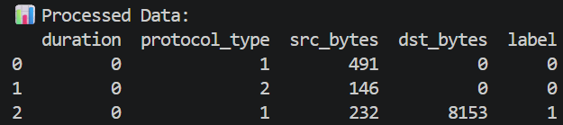
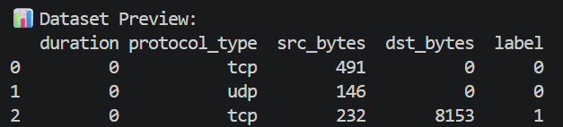
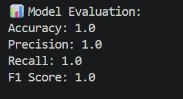
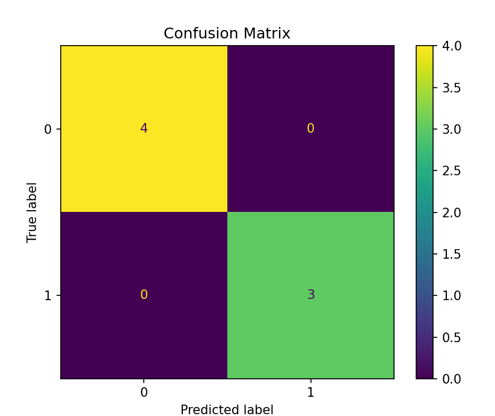
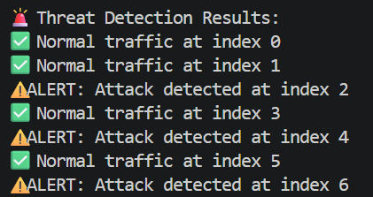

# 🔐 AI-Powered Cybersecurity Threat Detection System

## 📌 Project Overview
This project is a Machine Learning-based system that detects cyber threats from network traffic data.

It simulates how real-world cybersecurity systems identify attacks and anomalies using AI.

---

## 🎯 Problem Statement
Traditional security systems rely on rule-based detection, which fails to detect unknown or new attacks.

This project uses Machine Learning to:
- Identify abnormal patterns in network traffic
- Detect potential cyber threats
- Generate real-time alerts

---

## 🚀 Features
- Data preprocessing (cleaning & encoding)
- AI-based threat detection
- Model training using Random Forest
- Model evaluation (Accuracy, Precision, Recall, F1 Score)
- Confusion Matrix visualization
- Real-time threat alert system

---

## 🛠 Tech Stack
- Python
- Pandas
- NumPy
- Scikit-learn
- Matplotlib

---

## 📂 Project Structure

```
AI-Cybersecurity-Threat-Detection-System/
│
├── data/          → dataset  
├── src/           → source code  
├── images/        → screenshots  
├── outputs/       → generated results  
├── main.py        → main execution file  
├── README.md      → project documentation  
```

---

## ⚙️ How It Works (Workflow)

1. Load dataset (network traffic data)
2. Preprocess data (clean + encode categorical values)
3. Train Machine Learning model
4. Evaluate model performance
5. Predict threats (normal vs attack)
6. Generate alerts for suspicious activity

---

## ▶️ How to Run

Step 1: Install dependencies  
pip install -r requirements.txt

Step 2: Run the project  
python main.py

---

## 📊 Results

### 🔹 Dataset Preview


### 🔹 Model Output


### 🔹 Model Metrics


### 🔹 Confusion Matrix


### 🔹 Threat Detection


---

## 🚨 Sample Output

- Normal traffic at index 0  
- Normal traffic at index 1  
- ALERT: Attack detected at index 2  
- Normal traffic at index 3  
- ALERT: Attack detected at index 4  

---

## 🧠 Learning Outcomes
- Built complete Machine Learning pipeline
- Understood cybersecurity threat detection concepts
- Learned data preprocessing techniques
- Implemented classification models
- Created real-time alert system

---

## 💡 Future Improvements
- Use real-world datasets (KDD, CICIDS)
- Add real-time network monitoring
- Build dashboard using Streamlit
- Deploy using cloud (AWS / Azure)

---

## 📌 Author
Nidhi Apotikar